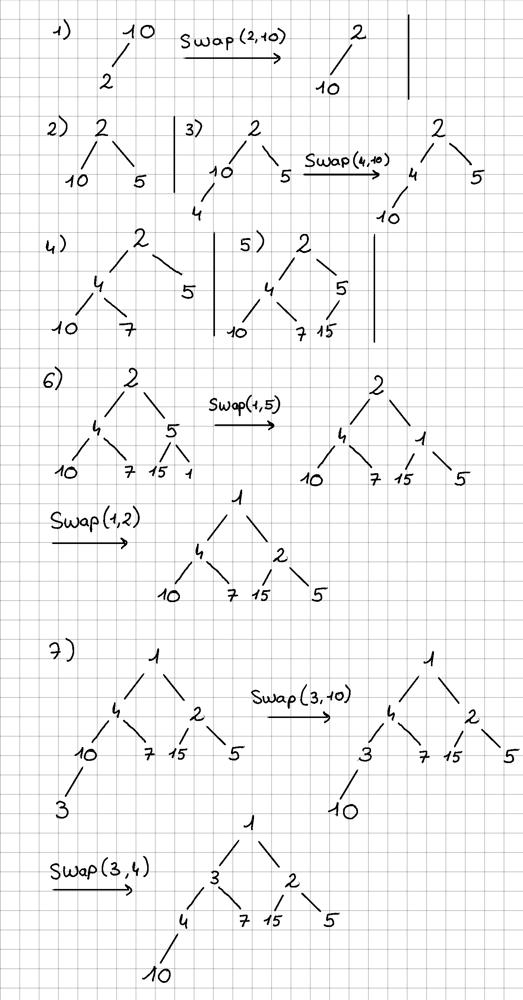
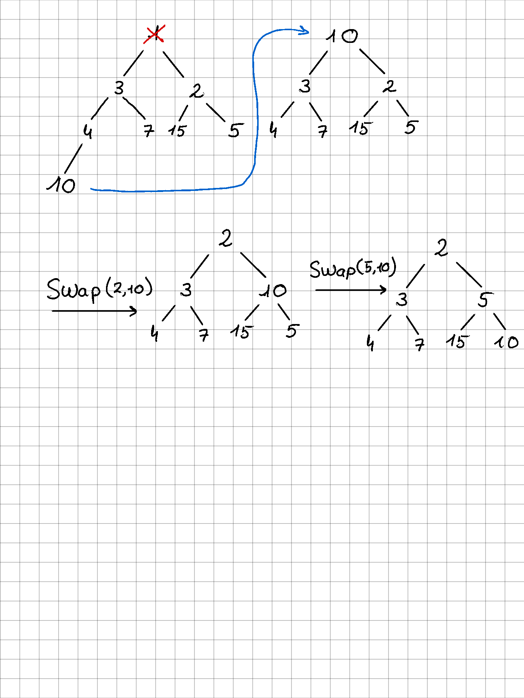

# Exercice 1

## Question 1

Un arbre est une structure de donnéespermettant de manipuler des ensemble d'éléments quelconque.  
Il est caractérisé par un élément racine, des éléments intermédiaires et des feuilles. Ces éléments
sont appelés des noeuds de l'arbre.  

Un arbre est dit:
- Binaire: si chaque noeud possède <u>au plus</u> 2 fils.
- Complet: si tous les niveaux sauf le dernier sont remplis.
- Tassé à gauche: si les feuilles sont stockées de gauche à droite.

Un tas est un ensemble d'éléments auxquels sont associés des clés (des entiers en pratique)
structuré en un arbre binaire complet tassé à gauche et tel que tout noued possède une clé plus grande
que celle de son père.

## Question 2

On insère les éléments sur la gauche en premier. On vérifie que l'élément inséré à une clé plus 
grande que celle de son père. Si ce n'est pas le cas, on fait un swap et on vérifie si le changement 
reste valide jusqu'à la racine si nécéssaire.  

## Question 3

Le plus petit élément est à la racine du tas. Pour garder la structure de tas et garantir que l'arbre 
est complet. On commence par remplacer la racine par le dernier élément (Element le plus à droite du 
niveau le plus bas). Ensuite on effectue des swap à partir de la racine pour garantir que les clés 
sont bien ordonnées.

## Question 4

- Pour $h=0$: $O \leq n \leq 1$
- Pour $h=1$: $0+2 \leq n \leq 1+2$
- Pour $h=2$: $ 0+2+2 \leq n \leq 1+2+4 $
- ...
- Pour $h$: $2^h \leq n \leq \sum_{i=0}^n2^i = 2^{n+1}-1$

## Question 5

