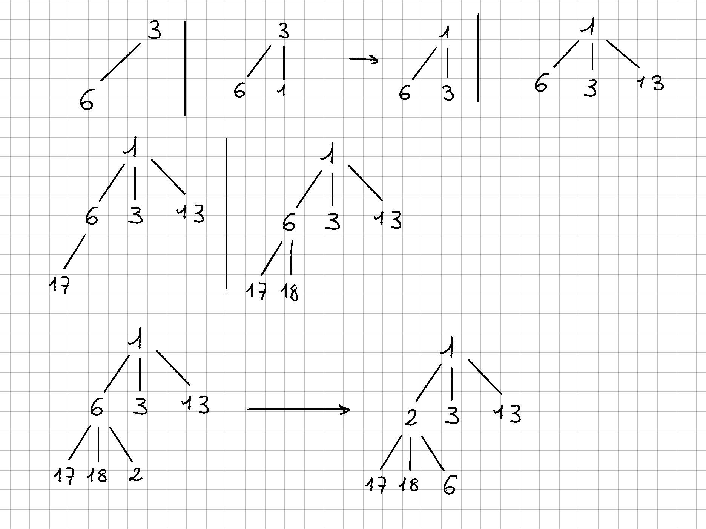

# Exercice 2

## Question 1

## Question 2

En procédant comme dans l'exercice précédent on peut montrer que pour tout n donné 
la hauteur h vérifie $h = \lfloor log_3(2n+1) \rfloor$.  
Le coût d'inesrtion d'un élément est en $O(log_3(n))$. L'utilisation d'un ternaire ne 
permet pas d'améliorer le coût d'insertion.

## Question 3

Soit $i$ le numéro d'un noeud quelconque:
- $num(fg) = 3i -1$
- $num(fm) = 3i$
- $num(fd) = 3i+1$
- $num(père) = \frac{num(fg)+num(fm)+num(fd)}{9}$

## Question 4

Un stockage efficace en mémoire d'un tas de n éléments peut se faire avec un tableau, l'arbre étant 
complet et les $n$ éléments tiennent nécéssairemment dans $n$ cases successives indexés de 1 à n 
(ou de 0 à n-1). L'accès du noeud $i$ est donc immédiat et ne présuppose pas de parcourir d'autres 
noeuds comme ce serait le cas dans une liste chaînée. Les relations entre numéros permettent en outre 
un accès immédiat aux noeuds fils ou père s'ils existent.

## Question 5

Dans le pire cas, on parcourt un chemin de la racine à une feuille en entier. La complexité est 
donc en $O(log(n))$
